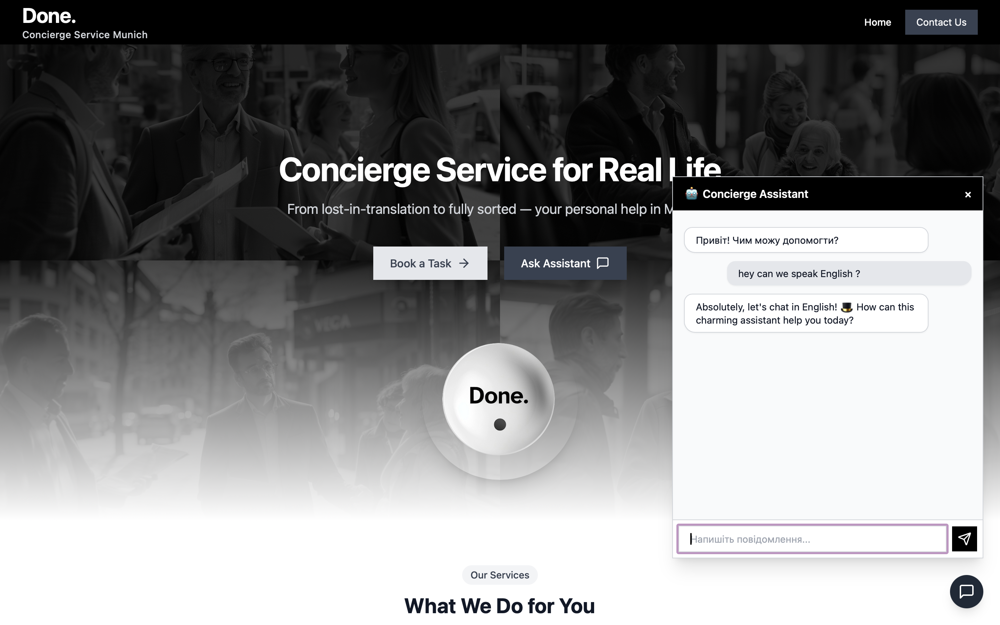
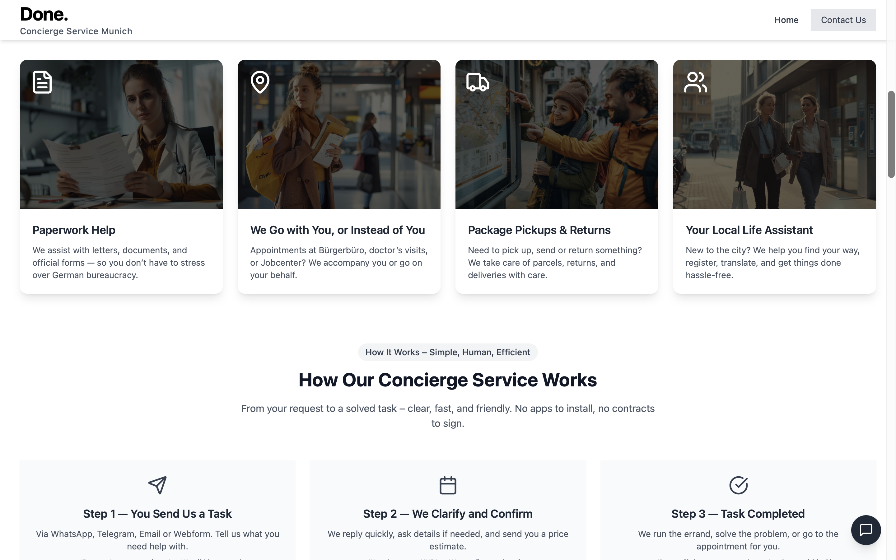
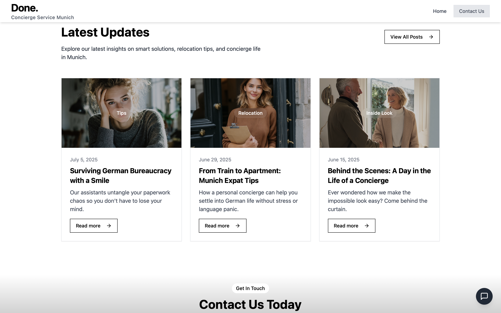
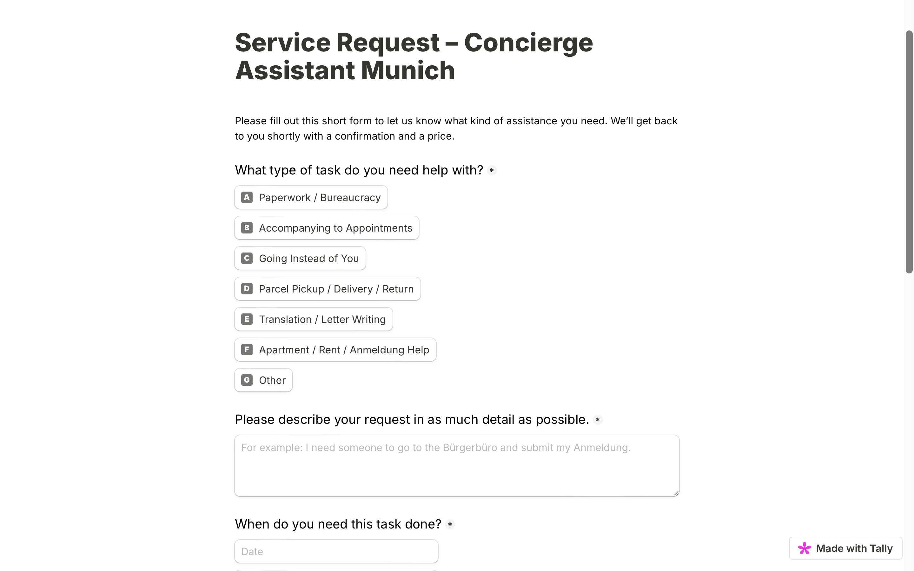
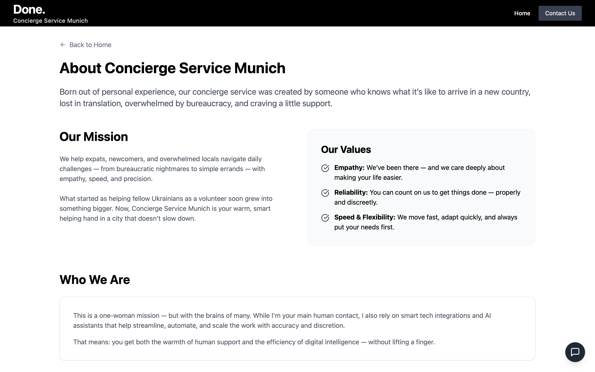
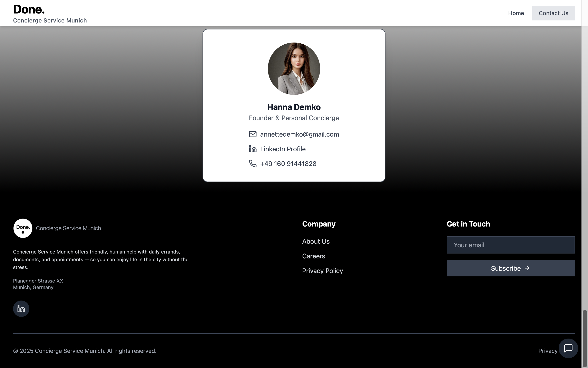

# 💼 Concierge Service Munich (Portfolio Fragment)

[](https://concierge-service-fhwk.vercel.app)

> ⚠️ **Note:** This is a **fragment** of the full project (demo for portfolio purposes).  
> Only one main page is presented here, but it includes several functional elements and integrations.

---

## ✨ Overview

Personal **concierge/assistant service website** for Munich.  
Built using a modern stack (**Vite, React, Tailwind, shadcn/ui**).  
The demo showcases a **landing page fragment** with interactive UI and service logic.

---

## 🚀 Live Demo

👉 [Try it on Vercel](https://concierge-service-fhwk.vercel.app)

---

## 🔥 Key Features

- **Responsive UI**:
  - Hero, Features, Projects, BlogPreview sections
- **Navbar + Page Layout**:
  - Consistent layout across all pages
- **Global Contact Section**:
  - Reusable ContactInfo on all pages
- **Integrated Chatbot**:
  - Powered by **ChatGPT (OpenAI API)**
  - Supports **Telegram** & **WhatsApp**
  - Lead collection via **Tally form**
  - Auto language detection (multi-language ready)
- **Smooth Animations**:
  - framer-motion + tailwindcss-animate
- **Modern Components**:
  - shadcn/ui & Radix UI (Navigation Menu, Tooltip, Scroll Area, etc.)

---

## 🖼️ UI Preview

**Hero Section**  


**Hero Section + Chatbot**  


**What We Do For You (Features)**  


**Latest Updates (Blog Section)**  


**Contact Form via Tally**  


**About Us Page**  


**Contact Information Section**  


---

## 🛠️ Tech Stack

- **Frontend**: Vite, React 18, TypeScript  
- **UI & Styling**: Tailwind CSS, shadcn/ui, Radix UI  
- **Animations**: framer-motion, tailwindcss-animate  
- **Icons**: lucide-react  
- **Data/State Management**: @tanstack/react-query  
- **Markdown Rendering**: react-markdown + remark-gfm  
- **Integrations**:
  - Chatbot with OpenAI (GPT)
  - Telegram & WhatsApp messaging
  - Tally form for lead collection  

---

## 📁 Project Structure

```
src/
├── components/
│   ├── ui/
│   │   ├── card/
│   │   ├── button/
│   │   ├── scroll-area/
│   │   ├── navigation-menu/
│   │   ├── tooltip/
│   │   └── Chatbot/
│   ├── Navbar.tsx
│   ├── ContactInfo.tsx
│   └── PageLayout.tsx
├── pages/
│   ├── Index.tsx
│   ├── About.tsx
│   ├── Careers.tsx
│   └── PrivacyPolicy.tsx
```

---

## 📌 Notes

- This is **not the full project**, just a **polished portfolio fragment**  
- Main focus: **UI, chatbot integration, lead generation UX**  
- Full version includes admin panel, CRM features, and more service logic

---

## ⚡ Quick Start

```bash
git clone https://github.com/annettedemko/concierge-service.git
cd concierge-service
npm install
npm run dev
```

---

## ⚠️ License & Usage

This project was created **exclusively for portfolio purposes**.  
It is **not licensed** for reuse, redistribution, commercial deployment, or modification.  
Any form of unauthorized use is strictly prohibited.

Designed and developed by [Hanna Demko](https://github.com/annettedemko)
